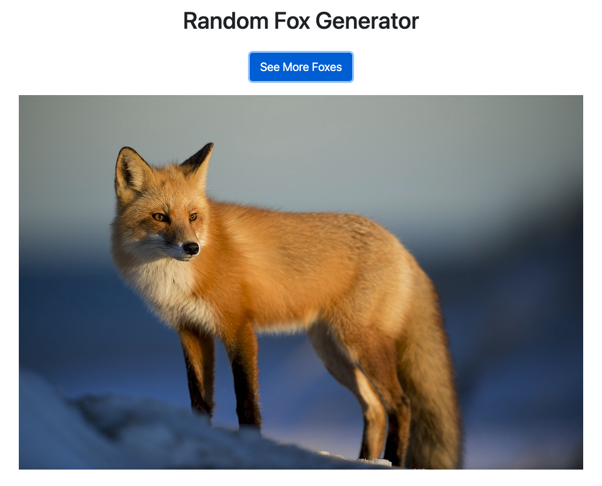

# Fetch And Render

### Description

This program is a random fox picture generator. It fetches fox images from a random fox picture API and renders the pictures on the page. To load a new random fox picture, the user can click the **See More Foxes** button, and the progam will fetch a new picture from the API to be rendered on the page. 

### How to Run

1. Download the zip file in github and navigate to the **Fetch-And-Render-main** directory in the terminal.
2. Run `http-server -c-1`.
3. When that is complete, load **localhost:8080** in the browser and click on the link for **index.html**. This will load the project in the browser.
4. click on the **See More Foxes** button to load a new random picture of a fox.

### Roadmap of Future Improvements

- **Hyperlink to image** I plan to add the functionality of creating a hyperlink out of the image that the user can use to navigate to where the image came from. 
- **Styling** I plan to improve the styling of the components so the webpage is more animated.

### License Information
Completed as an assignment for the [MIT Professional Certificate in Coding: Full Stack Development with MERN](https://executive-ed.xpro.mit.edu/professional-certificate-coding?utm_source=Google&utm_medium=c&utm_term=mit%20coding&utm_location=1027726&utm_campaign=B-365D_US_GG_SE_PCC_Brand&utm_content=MIT-Coding___School_Duration&gclid=Cj0KCQiAweaNBhDEARIsAJ5hwbe5iGViYiDsRYlBGKAHHLbH-GiiJ16dKOBbV7tvosiu9UTfbS7tAygaAkW1EALw_wcB).

See [MIT license](https://github.com/brandontanner/Fetch-And-Render/blob/main/LICENSE).
